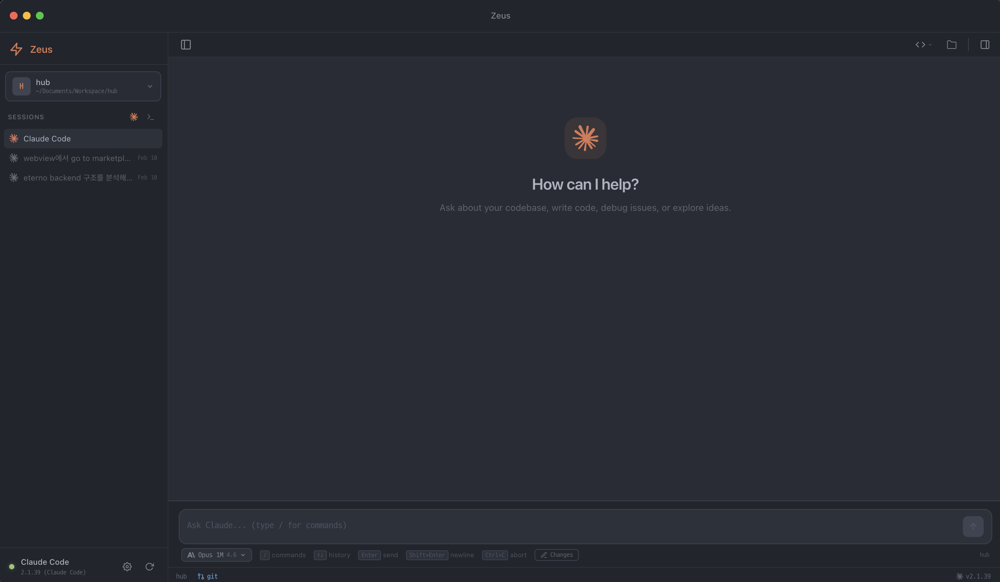

# ⚡ Zeus

**The desktop app built for Claude Code power users.**

Zeus wraps Claude Code in a purpose-built interface — a dedicated input bar, workspace switching, skill management, docs preview, and IDE integration — all in one window. Stop juggling terminals and config files. Just open Zeus and code.



---

## Why Zeus?

| Pain point                                                 | Zeus solution                                                                               |
| ---------------------------------------------------------- | ------------------------------------------------------------------------------------------- |
| Typing in a raw terminal feels clunky for AI conversations | **Dedicated input bar** with history, Ctrl+C, multi-line — separate from the output display |
| Switching repos means `cd`-ing around                      | **Sidebar workspace manager** — click to switch, drag to reorder, right-click for actions   |
| Managing `.claude/` skills and MCP servers by hand         | **Visual Skills & MCP panels** — toggle permissions, add servers, preview command files     |
| Reading project docs means leaving the terminal            | **Docs browser + viewer tabs** — browse markdown by folder, open as full-width tabs         |
| No easy way to open the repo in your IDE                   | **One-click IDE launch** — VS Code, Cursor, Zed, Windsurf, IntelliJ, and more               |
| Keeping Claude Code up to date                             | **Built-in updater** — check and update without leaving the app                             |

---

## Features Showcase

### Comprehensive Workspace Management

Organize your projects with a dedicated sidebar. Switch contexts instantly without losing your terminal history or Claude session state.

### Integrated Tooling Panel

Access your Skills, MCP servers, and Documentation in a unified right panel.


- **Skills**: Manage and preview your available Claude skills.
- **MCP**: Configure and monitor Model Context Protocol servers.
- **Docs**: Browse and read project documentation without leaving the app.

### Customizable Experience

Tailor Zeus to your preference with built-in themes including the default Claude Code dark mode, a warm Anthropic light theme, and a refined dark theme.


---

## Getting Started

### Install

```bash
git clone <repo-url> && cd zeus
npm install
```

### Run in development

```bash
npm run dev
```

### Build for production

```bash
npm run dist:mac     # macOS (.dmg + .zip)
npm run dist:win     # Windows (NSIS installer)
npm run dist:linux   # Linux (AppImage)
```

### Requirements

- **Node.js** 18+
- **Claude Code** — `npm install -g @anthropic-ai/claude-code`

---

## How to Use

### 1. Add a workspace

Click the **+** button in the sidebar or use the welcome screen. Select any project directory. Zeus remembers your workspaces and their order.

### 2. Launch Claude Code

Click **Claude Code** in the toolbar (or `Cmd+Shift+C`). Zeus opens a new Claude tab, starts the shell, and launches `claude` automatically. Type your prompts in the **input bar** at the bottom — output streams above.

### 3. Run terminal commands

Click **Terminal** in the toolbar (or `Cmd+T`). The same input bar / output display pattern applies. Enter sends the command; `Shift+Enter` for multi-line; `↑↓` for history; `Ctrl+C` to interrupt.

### 4. Switch workspaces

Click any workspace in the sidebar. Drag the **⠿** handle to reorder. Right-click for quick actions: open terminal, run Claude, reveal in Finder, or remove.

### 5. Open in your IDE

Click the **folder icon** in the toolbar. Zeus detects installed IDEs (VS Code, Cursor, Zed, Windsurf, IntelliJ, etc.) and opens the current workspace in your choice.

### 6. Browse docs

Open the right panel (`Cmd+I`) and select the **Docs** tab. Markdown files are listed by folder with highlighted paths. Click a file to open it as a **full-width tab** in the main area — rendered with proper headings, code blocks, tables, and syntax highlighting.

### 7. Manage skills

In the right panel **Skills** tab, you can:

- **Toggle built-in tools** (Bash, Read, Write, Edit, Grep, etc.) per scope (global / project)
- **See custom slash commands** from `~/.claude/commands/` and any `.claude/commands/` in your project or its subfolders
- **Preview command files** — click any custom command to see its markdown content and copy the `/user:name` or `/project:name` slug

### 8. Configure MCP servers

In the right panel **MCP** tab:

- View all configured MCP servers and their status
- Add new servers with command, args, and environment variables
- Install npm packages for MCP servers directly from the UI
- Remove or edit existing server configs

---

## Keyboard Shortcuts

| Shortcut           | Action                                   |
| ------------------ | ---------------------------------------- |
| `Cmd+T`            | New terminal tab                         |
| `Cmd+Shift+C`      | Launch Claude Code                       |
| `Cmd+B`            | Toggle sidebar                           |
| `Cmd+I`            | Toggle right panel (Skills / MCP / Docs) |
| `Cmd+K`            | Clear terminal output                    |
| `Cmd+W`            | Close current tab                        |
| `Enter`            | Send input                               |
| `Shift+Enter`      | New line in input                        |
| `↑` / `↓`          | Navigate command history                 |
| `Ctrl+C`           | Send interrupt (SIGINT)                  |
| `Ctrl+D`           | Send EOF                                 |
| `Tab`              | Send tab character                       |
| `Middle-click tab` | Close tab                                |
| `Scroll on tabs`   | Horizontal scroll                        |

---

## Design Choices

- **Input bar + output display** — Claude Code conversations and terminal commands both use a dedicated input bar at the bottom. The terminal area above is a read-only output display. This separates what you type from what you see, making AI interactions feel conversational rather than terminal-native.

- **Catppuccin Mocha theme** — The most popular developer color scheme, with excellent contrast and readability for both code and natural language output.

- **D2Coding + Pretendard fonts** — Optimized for developers who work in English and Korean. D2Coding (with ligatures) for monospace; Pretendard for UI text.

- **Login shell** — Terminals spawn as login shells (`--login`) so your `.zshrc`, aliases, `PATH`, and color settings all work out of the box.

- **Svelte 5 + WebGL** — Compiled UI with zero virtual DOM overhead. GPU-accelerated terminal rendering. The app stays fast with dozens of tabs open.

---

## License

MIT
